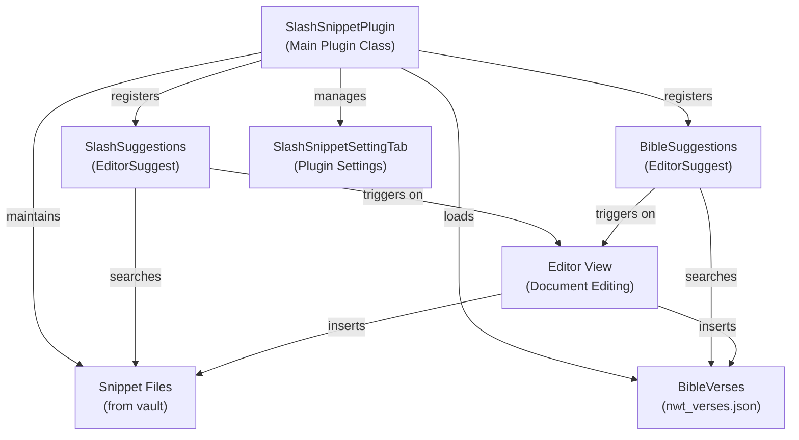
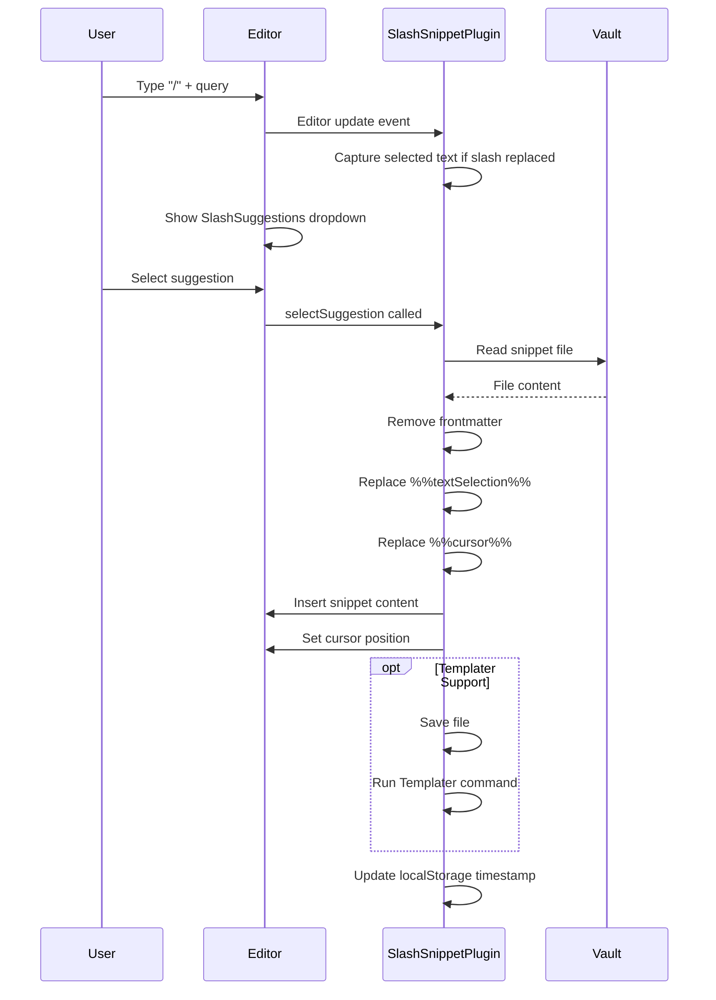
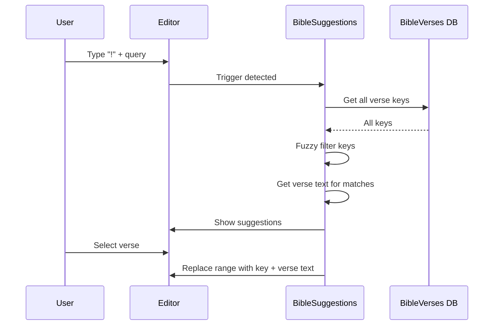

# Plugin Architecture

The insert-verse plugin is built on Obsidian's plugin API and consists of several interconnected components that handle Bible verse insertion, snippet management, and user configuration.

## System Overview



## Core Components

### SlashSnippetPlugin (Main)

**File**: `src/main.ts`

The main plugin class that extends `Obsidian.Plugin`. It orchestrates the entire plugin lifecycle:

#### Key Responsibilities:
- **Initialization** (`onload`): Registers both editor suggesters, loads settings, initializes Bible verses database
- **Settings Management**: Persists plugin configuration to Obsidian data storage
- **Snippet File Tracking**: Maintains a list of markdown files in the snippet folder and updates in real-time
- **Text Selection Tracking**: Monitors editor changes to capture selected text when trigger is replaced
- **Templater Integration**: Optionally runs Templater plugin commands on inserted snippets

#### Key Properties:
- `settings: SlashSnippetSettings` - Current plugin configuration
- `snippetFiles: TFile[]` - Array of accessible snippet files
- `bibleVerses: BibleVerses` - Bible verses database wrapper
- `selectedText: string` - Currently selected text (used for `%%textSelection%%` placeholder)

#### Key Methods:
- `loadAllTemplatedFiles()` - Scans vault for markdown files in snippet folder and initializes localStorage timestamps
- `listenForUpdates()` - Registers vault event handlers for create/delete file events
- `runTemplaterReplace()` - Executes Templater plugin commands with debounce
- `loadSettings() / saveSettings()` - Persist/load plugin configuration

### SlashSuggestions (Snippet Suggester)

**File**: `src/SlashSuggestions.ts`

Extends `EditorSuggest<SuggestionObject>` to provide inline suggestions for snippet insertion.

#### Trigger Mechanism:
- Monitors the current editor line for the slash trigger character (configurable)
- When detected, extracts the query string after the trigger
- Returns `null` if trigger not found (no suggestions shown)

#### Suggestion Generation:
- **Fuzzy Matching**: If enabled, matches partial character sequences (e.g., "btn" matches "Button")
- **Exact Substring Matching**: Falls back to substring search when fuzzy search is disabled
- **Scoring**: Prioritizes snippets that start with the query (score: 2) over partial matches (score: 1)
- **Last-Used Ranking**: When query is empty, returns snippets ranked by most recent use (stored in localStorage)

#### Suggestion Rendering:
- Displays snippet filename with optional highlighting of matched characters
- Can show file path, snippet preview, and previously selected text (configurable)

#### Insertion Flow:
1. Retrieves snippet file content from vault
2. Removes YAML frontmatter if configured
3. Replaces `%%textSelection%%` placeholder with captured selected text
4. Replaces `%%cursor%%` placeholder with empty string, noting its position
5. Inserts snippet content into editor at cursor range
6. Repositions cursor to `%%cursor%%` location or `%%textSelection%%` location if present
7. Optionally runs Templater replacement
8. Updates localStorage timestamp for snippet (used for "last used" ranking)

### BibleVerseSuggestions (Bible Verse Suggester)

**File**: `src/BibleVerseSuggestions.ts`

Extends `EditorSuggest<SuggestionVerse>` to provide inline suggestions for Bible verse insertion.

#### Trigger Mechanism:
- Monitors for the Bible trigger character (configurable, default: `!`)
- Extracts query after trigger

#### Fuzzy Matching:
- Implements fuzzy character matching: every character of query must appear in order in the verse key
- Example: "jhn 3" matches "John 3:16" (character sequence: j-h-n-3)
- Case-insensitive matching

#### Suggestion Rendering:
- Shows verse key (e.g., "John 3:16")

#### Insertion:
- Replaces trigger and query with verse key + space + verse text
- Example: `!jhn 3` becomes `John 3:16 For God so loved the world...`

### BibleVerses (Data Manager)

**File**: `src/BibleVerses.ts`

Loads and provides access to the Bible verses database.

#### Data Source:
- Reads `nwt_verses.json` from plugin directory (4.8 MB - New World Translation)
- Parses JSON into a flat object: `Record<string, string>` where key is verse reference and value is verse text

#### Methods:
- `load()` - Async load of verses JSON file
- `getVerse(reference: string)` - Returns verse text or undefined

### SlashSnippetSettingTab (Settings UI)

**File**: `src/SlashSnippetSettingTab.ts`

Extends `PluginSettingTab` to provide the settings UI in plugin preferences.

#### Configurable Settings:
- **bibleTrigger**: Single character trigger for Bible verse search (default: `!`)
- **slashTrigger**: Single character trigger for snippet search (default: `/`)
- **fuzzySearch**: Enable fuzzy matching (default: true)
- **highlight**: Show visual highlighting in search results (default: true)
- **showPath**: Display file paths in snippet suggestions (default: false)
- **showFileContent**: Show snippet preview in suggestions (default: false)
- **snippetPath**: Folder containing snippets (default: `Snippets`)
- **ignoreProperties**: Remove YAML frontmatter from snippets (default: true)
- **templaterSupport**: Run Templater on inserted snippets (default: true)
- **textSelectionString**: Placeholder for selected text (default: `%%textSelection%%`)
- **cursorPositionString**: Placeholder for cursor position (default: `%%cursor%%`)
- **maxSelectedTextLength**: Truncate selected text preview to this length (default: 50)
- **showSelectedText**: Show previously selected text in suggestions (default: false)

#### Validation:
- Enforces single-character triggers (shows error notice if multi-character input attempted)

## Data Flow Diagrams

### Snippet Insertion Flow



### Bible Verse Insertion Flow



### Text Selection Capture

When a user selects text and presses the snippet trigger `/`, the plugin captures the deleted text via the CodeMirror editor update listener:

1. Editor fires update event for text change
2. Plugin iterates transaction changes
3. When deleted text length > 0 AND inserted text = trigger character:
   - Captures deleted text into `selectedText` property
4. When user inserts snippet:
   - `%%textSelection%%` is replaced with captured text
   - `selectedText` is cleared for next use

## Settings Schema

```typescript
interface SlashSnippetSettings {
    slashTrigger: string;              // e.g., "/"
    bibleTrigger: string;              // e.g., "!"
    fuzzySearch: boolean;              // enable fuzzy matching
    highlight: boolean;                // highlight matches in UI
    showPath: boolean;                 // show file paths in suggestions
    showFileContent: boolean;          // show file preview in suggestions
    snippetPath: string;               // e.g., "Snippets"
    ignoreProperties: boolean;         // remove YAML frontmatter
    templaterSupport: boolean;         // run Templater on insert
    textSelectionString: string;       // placeholder for selected text
    cursorPositionString: string;      // placeholder for cursor
    maxSelectedTextLength: number;     // max chars to show in preview
    showSelectedText: boolean;         // show selected text in suggestions
}
```

## Dependencies

- **obsidian**: Plugin API and UI components
- **@codemirror/view**: Editor update event listeners
- **typescript**: Type-safe implementation
- **esbuild**: Build and bundling

## Build Process

The plugin uses esbuild for bundling:

- **Entry point**: `src/main.ts`
- **Output**: `main.js` (CommonJS format)
- **External modules**: Obsidian and CodeMirror modules (not bundled)
- **Development**: Inline sourcemaps, no minification, watch mode
- **Production**: Minified, no sourcemaps

## State Management

### Persistent State (via Obsidian.Plugin.saveData)
- Plugin settings stored in Obsidian plugin data directory

### Runtime State (Memory)
- `snippetFiles[]` - Reloaded on plugin start, updated via vault events
- `selectedText` - Captured from editor, cleared after use
- `bibleVerses.verses{}` - Loaded once at startup, immutable

### Local Storage (Browser localStorage)
- Snippet file access timestamps - Used for "last-used" ranking
- Key format: `{snippet_file_path}` → `{timestamp}`

## Extension Points

The plugin is extensible through:

1. **Templater Integration**: When enabled, runs Templater plugin commands after snippet insertion
2. **Settings**: All behavior is configurable via the settings tab
3. **Snippet Files**: Any markdown file in the snippet folder is automatically discovered and available
4. **Bible Database**: Could be extended to load different verse translations by replacing `nwt_verses.json`
