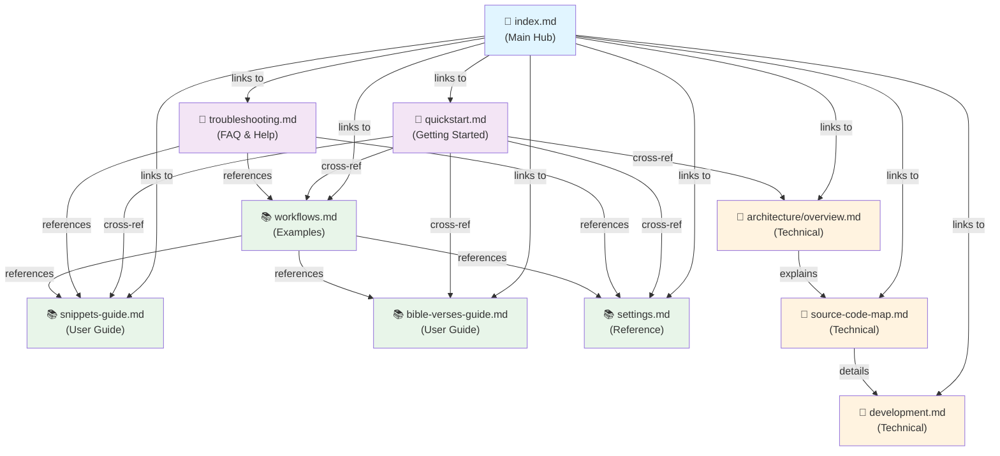

# Documentation Structure

This page provides a visual overview of how the insert-verse plugin documentation is organized.

## Documentation Hierarchy

```
openwiki/
├── index.md                          # Main entry point
├── INSTRUCTIONS.md                   # OpenWiki configuration
│
├── 📖 GETTING STARTED
│   ├── quickstart.md                # Installation & basic usage
│   └── troubleshooting.md           # FAQ & common problems
│
├── 📚 USER GUIDES
│   ├── snippets-guide.md            # Creating and organizing snippets
│   ├── bible-verses-guide.md        # Bible verse insertion
│   ├── settings.md                  # Configuration reference
│   ├── workflows.md                 # Example workflows
│   └── workflows/                   # (Future: workflow breakdowns)
│
├── 🔧 TECHNICAL DOCS
│   ├── architecture/
│   │   ├── index.md                # (auto-generated)
│   │   └── overview.md             # System design & diagrams
│   ├── source-code-map.md          # Complete code reference
│   └── development.md              # Build & dev setup
│
└── 📋 MAINTENANCE
    └── _init-summary.md            # This initialization log
```

## Page Relationships



## Navigation Paths by User Role

### 👤 New User Path

```
index.md
  ↓
quickstart.md (Installation & Setup)
  ↓
snippets-guide.md (Learn Features)
  ↓
workflows.md (See Examples)
  ↓
[Start Using Plugin]
  ↓ (if problems)
troubleshooting.md (Get Help)
```

### ⚙️ System Administrator / Configurator Path

```
index.md
  ↓
settings.md (All Configuration Options)
  ↓
workflows.md (See Recommended Setups)
  ↓
snippets-guide.md (Create Organization)
  ↓
[Configure for Team]
  ↓ (if issues)
troubleshooting.md (Troubleshoot)
```

### 👨‍💻 Developer Path

```
index.md
  ↓
architecture/overview.md (Understand Design)
  ↓
source-code-map.md (Learn Implementation)
  ↓
development.md (Set Up Environment)
  ↓
[Start Coding]
  ↓ (if questions)
architecture/overview.md (Reference)
```

### 🆘 Troubleshooting Path

```
troubleshooting.md
  ↓
[Find Your Problem]
  ↓ (if about snippets)
snippets-guide.md
  ↓ (if about verses)
bible-verses-guide.md
  ↓ (if about settings)
settings.md
  ↓ (if still stuck)
[Post Issue]
```

## Content Mapping

### By Feature

| Feature | User Guide | Settings | Workflows | Architecture |
|---------|-----------|----------|-----------|--------------|
| Snippet Insertion | snippets-guide | settings | workflows | architecture |
| Bible Verse Lookup | bible-verses | settings | workflows | architecture |
| Fuzzy Matching | snippets-guide | settings | — | architecture |
| Cursor Positioning | snippets-guide | — | workflows | — |
| Text Selection | snippets-guide | settings | workflows | — |
| Templater Integration | snippets-guide | settings | workflows | — |

### By Topic

| Topic | Primary Page | Cross-References |
|-------|-------------|------------------|
| Snippet Creation | snippets-guide | workflows, troubleshooting |
| Bible Search | bible-verses-guide | workflows, troubleshooting |
| Configuration | settings | troubleshooting, workflows |
| Workflows | workflows | snippets-guide, bible-verses-guide |
| Architecture | architecture/overview | source-code-map, development |
| Implementation | source-code-map | architecture/overview, development |
| Development | development | source-code-map, architecture/overview |
| Help & Issues | troubleshooting | settings, workflows, snippets-guide |

## File Statistics

```
Total Pages: 11
├── Hub/Navigation: 1 (index.md)
├── Getting Started: 2 (quickstart.md, troubleshooting.md)
├── User Guides: 4 (snippets-guide.md, bible-verses-guide.md, settings.md, workflows.md)
├── Technical: 3 (architecture/overview.md, source-code-map.md, development.md)
└── Maintenance: 1 (_init-summary.md)

Total Size: ~125 KB
Average Page: ~11 KB
Largest Page: source-code-map.md (19 KB)
Smallest Page: quickstart.md (4 KB)
```

## Conventions Used

### Page Front Matter

Every page includes OKF-compliant YAML front matter:

```yaml
---
type: <Page Type>              # Required: Guide, Reference, etc.
title: <Display Name>          # Recommended: Human-readable
description: <Short Summary>   # Recommended: 1-2 sentences
tags: [tag1, tag2]            # Optional: Search keywords
openwiki:                      # Optional: Internal metadata
  roles: [architecture]
  source_paths: [path/to/file]
---
```

### Link Format

Internal links use absolute paths with `/openwiki/` prefix:

```markdown
# Cross-reference another page
[Link text](/openwiki/page-name.md)
[Link text](/openwiki/section/page-name.md)
```

### Code Examples

Code examples are provided for key concepts:

```markdown
# Snippet with language specification
\`\`\`markdown
---
title: Example
---
Content here
\`\`\`
```

### Diagrams

Mermaid diagrams illustrate flows and relationships:

```markdown
\`\`\`mermaid
graph TD
  A --> B
  B --> C
\`\`\`
```

## Search and Discovery

### By Keyword

Common searches and their best pages:

| Keyword | Best Page |
|---------|-----------|
| "Install" | quickstart.md |
| "Snippet" | snippets-guide.md |
| "Bible verse" | bible-verses-guide.md |
| "Fuzzy search" | settings.md or snippets-guide.md |
| "Cursor" | snippets-guide.md or workflows.md |
| "Settings" | settings.md |
| "Templater" | snippets-guide.md or workflows.md |
| "Error" | troubleshooting.md |
| "Architecture" | architecture/overview.md |
| "Code" | source-code-map.md |

### By Problem

Common problems and their best pages:

| Problem | Best Page |
|---------|-----------|
| Plugin not working | troubleshooting.md |
| Can't insert snippet | snippets-guide.md |
| Can't find verse | bible-verses-guide.md |
| Cursor in wrong place | snippets-guide.md |
| Settings not saving | troubleshooting.md |
| Performance slow | troubleshooting.md |

## How This Structure Helps

### For Discoverability

- **Multiple entry points**: Start from index.md or your specific problem
- **Role-based paths**: Navigate based on your use case
- **Cross-references**: Related content links to each other
- **Tags and keywords**: Enable full-text search across docs

### For Maintenance

- **Organized by topic**: Easy to find what to update
- **Single source of truth**: Each concept documented once
- **Clear relationships**: Know what else might need updating
- **Version tracking**: Timestamps and change notes possible

### For Comprehensiveness

- **Topic coverage**: All features and components documented
- **Workflow examples**: Real-world use cases included
- **Troubleshooting**: Common problems addressed
- **Technical depth**: Architecture and implementation explained

## Adding New Documentation

### New User Guide

1. Create `/openwiki/new-topic.md` with OKF front matter
2. Add section to appropriate category in index.md
3. Cross-reference from related pages
4. Add tags for search discoverability

### New Architecture Topic

1. Create `/openwiki/architecture/new-topic.md`
2. Link from `architecture/overview.md`
3. Reference from `source-code-map.md` if code-related
4. Add to development guide if implementation-relevant

### Updating Existing

1. Preserve OKF front matter
2. Update content as needed
3. Check cross-references for consistency
4. Update any diagrams if structure changed
5. Update this page if navigation changed

---

This documentation structure provides clear paths for all users while maintaining a comprehensive reference for developers and contributors.
